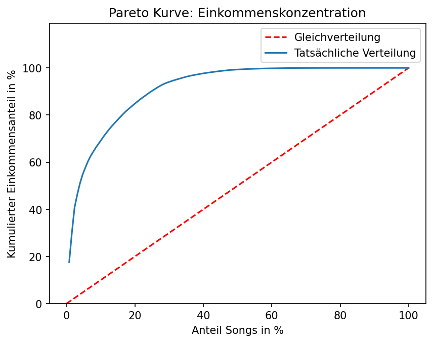
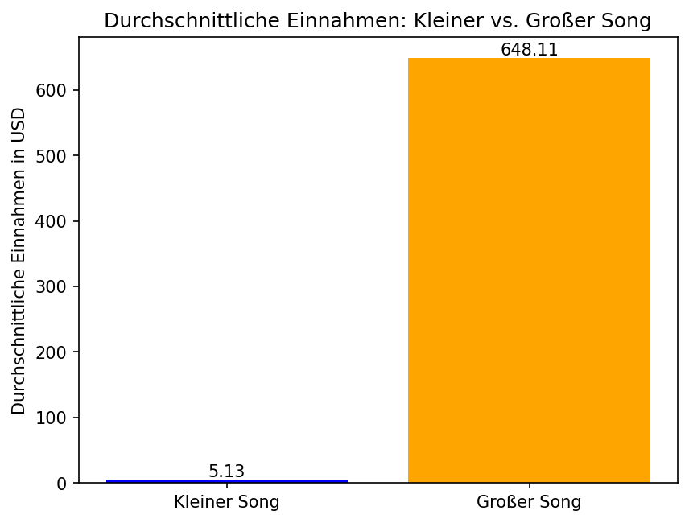
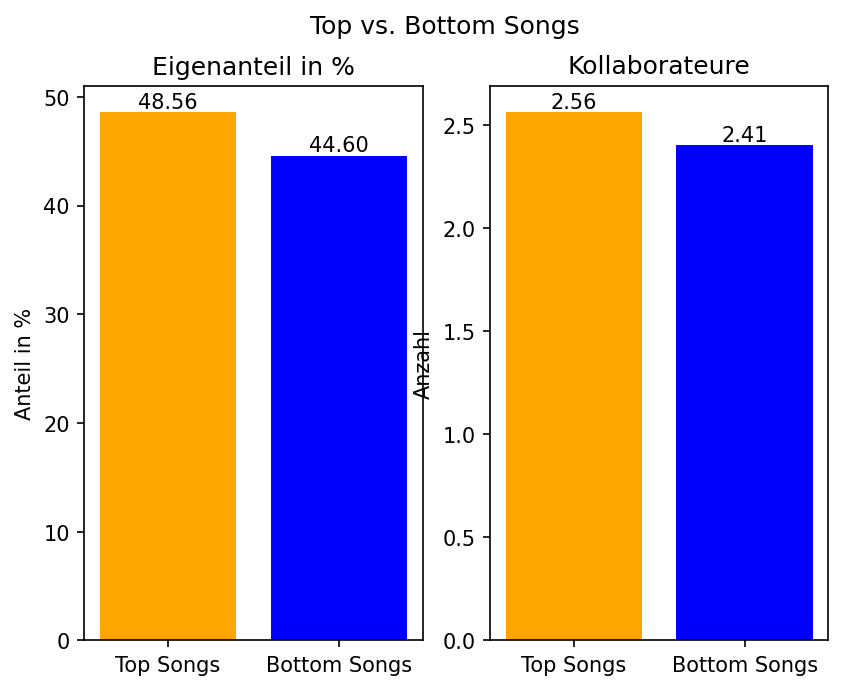

# Royalty Catalogue Analysis

> Welcher Produktionstyp ist für einen Musikproduzenten finanziell wertvoller:
> **kleine Anteile an großen Songs** oder **große Anteile an kleinen Songs**?
> Eine Analyse meines eigenen Tantiemen-Katalogs mit insgesamt 128 Songs.

## Fragestellung

Als Produzent arbeite ich sowohl an größeren Projekten wie z.B. Netflix Shows mit vielen Beteiligten, wodurch meine Anteile an der Komposition kleiner werden, als auch an kleineren Projekten mit einem einzigen Künstler, wodurch mein Eigenanteil größer wird. Diese Analyse untersucht anhand realer, von mir über die Jahre angesammelter Daten:

1. Welcher Projekttyp hat mir historisch **mehr Einnahmen** gebracht?
2. Wie **konzentriert** ist mein Einkommen?
3. Was **charakterisiert** meine Top-Songs?

## Daten

- Quelle: Publishing Abrechnungen (SCORE) im Zeitraum Juni 2022 - Juni 2026
- Einheit der Analyse: ein Song (Werk).
- Zielgröße: mir zustehende Einnahmen in USD.
- Abgeleitete Kennzahl: **„wahre Songgröße" ≈ Einnahme ÷ Eigenanteil %**
  (Näherung der gesamten Tantiemen Masse eines Songs, unabhängig von meiner Scheibe).

> **Anmerkung zum Datenschutz:** Die echten Abrechnungsdaten sind nicht Teil dieses Repository
> (siehe `.gitignore`). Zum Nachvollziehen liegt ein anonymisierter Beispieldatensatz
> in `data/raw/sample/`.

## Methodik

Rohe Abrechnungsdaten aus dem Sony Music Publishing Portal für Künstler (SCORE) wurden
bereinigt und mit Writer Split Daten zusammengeführt. Daraus wurden die Kennzahlen
"true_song_size" und "is_large_song" abgeleitet und anhand deskriptiver Statistik und 
Visualisierung analysiert und veranschaulicht.

## Ergebnisse

### 1. Einkommenskonzentration (Pareto)
Anhand der Pareto Kurve kann man deutlich erkennen, dass das Vermögen sich
hauptsächlich durch die erfolgreichsten paar Songs erklären lässt, denn allein
die Top 5 Songs im Katalog (welche circa 4% des Katalogs entsprechen) bilden
bereits 51% der Gesamteinnahmen. 



### 2. Kleiner vs. Großer Song
Beim Vergleichen der durchschnittlichen Einnahmen bei kleinen Songs mit hohen Anteilen
vs. großen Songs mit kleinen Anteilen lässt sich herauslesen, dass es deutlich lukrativer
ist, kleine Anteile von großen Songs sich zuzuschreiben statt andersrum.
Ich habe "is_large_song" über "true_song_size" definiert, die selbst von Einnahmen
abhängt.
Während die durchschnittlichen Einnahmen bei großen Songs bei circa 648 USD liegen, betragen diese
bei einem kleinem Song durchschnittlich 5 USD.



### 3. Top vs. Bottom Songs
Anhand der Daten über den Eigenanteil in % und der Anzahl der Kollaborateure 
an den größsten- und kleinsten- 32 Songs aus dem Katalog kommt man zur Erkenntnis, dass
sich die Werte bei den Beiden kaum voneinander unterscheiden. Daraus lässt sich schließen,
dass es sehr wahrscheinlich an anderen Faktoren liegt, ob ein Song groß oder klein ist.
Vielleicht an der Bekanntheit des Künstlers, oder am Glück, oder einem viralem Trend im Netz.



## Wichtigste Einschränkungen

- Die Daten messen **Einnahmen**, nicht Streams oder Hörverhalten.
- „Wahre Größe" ist eine **Näherung**, denn Teilen durch kleine Anteile verstärkt Fehler.
- Die Analyse ist **rückblickend beschreibend**, nicht kausal. Diese zeigt, was sich
  bisher gelohnt hat, nicht zwingend, welche Strategie künftig optimal ist.
- da "is_large_song" über "true_song_size" definiert ist, welches 
selbst von "my_earnings_usd" abhängig ist, werden Songs mit hohen Einnahmen automatisch
als "groß" klassifiziert, und dadurch ist auch der Befund "große Songs verdienen mehr"
nur teilweise per Definition wahr, nicht rein empirisch.
- Die Einnahmen messen ausschließlich Publishing Tantiemen. Diese sind nur ein kleiner,
verzögerte und plattformabhängiger Bruchteil des Gesamterfolgs eines Songs.
Streams, Chartplatzierungen oder kulturelle Reichtweite werden nicht betrachtet.

## Reproduzieren

```bash
pip install -r requirements.txt
jupyter notebook notebooks/01_analysis.ipynb
```

## Tech-Stack

Python · pandas · matplotlib · Jupyter
